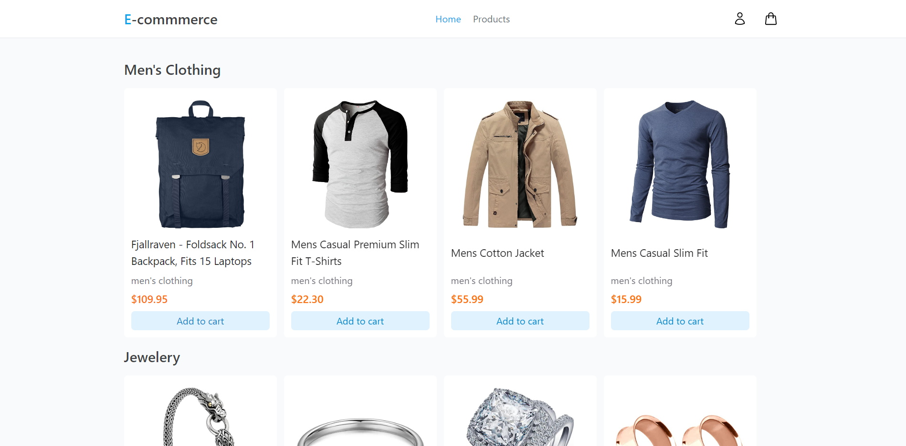
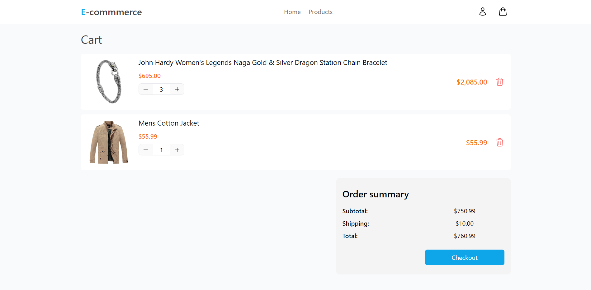

# vue-e-commerce
Simple e-commerce application built with Vue 3

[vue-e-commerce.pages.dev](vue-e-commerce.pages.dev)





## Technologies used
- Vue 3 Composition Api
- Typescript
- TailwindCSS
- Pinia
- Headless UI
- Supabase
- Axios

## Project Setup

```sh
yarn # or npm install
```

### Compile and Hot-Reload for Development

```sh
yarn dev # or npm run dev
```

### Type-Check, Compile and Minify for Production

```sh
yarn build # or npm run build
```

### Run Unit Tests with [Vitest](https://vitest.dev/)

```sh
yarn test:unit #or npm run test:unit
```
